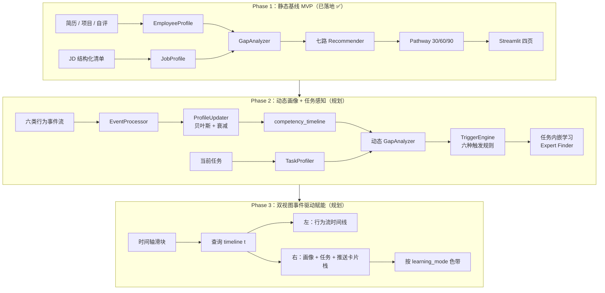
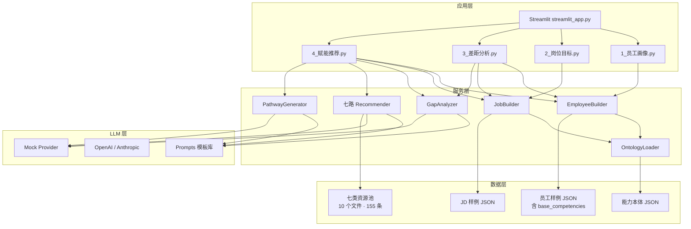

# 架构演进文档

## 一、三阶段架构全景



## 二、Phase 1 组件图（已落地）



## 三、核心数据流（Phase 1）

### 3.1 员工画像构建

```
employees.json（base_competencies）
       │ 读取预置能力基线
       ▼
EmployeeBuilder.build_profile(emp_id)
       │
       ▼
LLM ExtractEmployee Prompt（可选增量）
       │
       ▼
ResolveCompetency（id/别名归一）
       │
       ▼
合并（max level, max confidence）
       │
       ▼
EmployeeProfile { competencies: [CompetencyTag] }
```

**关键决策**：`base_competencies` 作为人工预置基线，让 Mock 模式下也能得到真实可用的画像；LLM 模式再做增量补充。

### 3.2 Gap 分析

```
EmployeeProfile × JobProfile
       │
       ▼
结构化差值：need_level - have_level
       │
       ▼
启发式优先级：gap ≥ 2 或 gap*weight ≥ 0.25 → high
       │
       ▼
（仅对 gap > 0 的条目）LLM 裁判 rank_gap Prompt
       │
       ▼
GapItem 列表（按 priority 排序）
```

**额外产物**：`match_score` = Σ weight × min(have, need) / Σ weight × need（0-1）

### 3.3 七路推荐

```
for each Recommender in [project, lab, mentor, case, talk, course, reading, tool, prompt]:
    retrieve:
        for resource in pool:
            hit = resource.related_competencies ∩ gap_ids
            score = Σ gap_weight[c] × priority_multiplier + extra_score
        Top-20 by score
    rerank:
        LLM RerankResource Prompt（含 learning_mode_constraint）
        score_final = 0.4 × normalized_recall + 0.6 × llm_score
        Top-5
```

**并行策略**：当前顺序执行（十几毫秒级），后续可改 `asyncio.gather`。

**分组聚合**：`group_by_learning_mode()` 把七路结果按 `experiential / social / formal / tool` 四个 bucket 分类，每 bucket 内按 score 排序。

### 3.4 路径合成

```
gaps + recs（七路汇总排序）
       │
       ▼
LLM GeneratePathway Prompt（含约束：每阶段 ≥1 experiential + ≥1 social + ≥1 formal）
       │
       ▼
验证：phase ∈ {30d,60d,90d}，resources ⊂ pool
       │   失败
       ▼
兜底规则：
  30d → formal + tool + social
  60d → experiential + social + formal
  90d → experiential + social + tool
       │
       ▼
Pathway { milestones: [PathwayMilestone × 3] }
```

## 四、关键设计决策记录（ADR）

### ADR-1：Mock LLM + Hash Embedding 作为默认降级路径

**决策**：LLM 和 Embedding 都支持 Mock/Hash 降级，无 API Key 也能跑通。

**原因**：
- Demo 场景下展示优先，不希望因网络或额度问题卡壳
- 单测 / CI / 本地冒烟需要零依赖
- Mock 输出是结构化合法 JSON，下游 Pydantic 校验能通过

**代价**：Mock 不具备真实语义理解，推荐质量依赖 `base_competencies` 与 `related_competencies` 精确匹配。

### ADR-2：能力本体规模（36 个节点）

**决策**：v1.0 使用 4 大类 × 36 能力节点，不追求 O*NET 的数千个 skill 颗粒度。

**原因**：
- Demo 员工样本 20 人，JD 10 份，能力节点太细会导致每项覆盖率过低
- 36 个节点足够覆盖知识工作者主流场景
- 更细的颗粒度属于 Phase 4 多岗位适配

### ADR-3：七路 Recommender 而不是单路融合

**决策**：每种 learning_mode 独立一个 Recommender 类，而非一个总的排序模型。

**原因**：
- 不同 mode 的候选资源字段结构差异大（课程有 duration、导师有 capacity）
- 70-20-10 展示要求按 mode 分 Tab，天然适合"每路各取 Top-K"而不是全局 Top-K
- 每路 Prompt 可以注入差异化约束（如 mentor 要考虑 capacity，tool 要强调 ROI）

### ADR-4：`base_competencies` 作为人工预置基线

**决策**：员工样例里直接预置 `base_competencies`，而不是完全靠 LLM 从简历抽取。

**原因**：
- 简历和项目经历的措辞多样，LLM 抽取的一致性有上限（尤其在 Mock 模式）
- 人工预置可以保证每位员工的能力画像"正确"，便于 Demo 展示可控
- 实际生产时，`base_competencies` 可来自上一轮模型 + 本轮人工校正，构成闭环

### ADR-5：路径兜底规则硬编码 mode 组合

**决策**：`pathway_generator` 在 LLM 失败时按固定 mode 组合挑资源。

**原因**：
- 保证任何情况下都有 3 个阶段完整产出
- mode 组合（30d formal+tool+social / 60d experiential+social+formal / 90d experiential+social+tool）来自学习科学常识
- 即便 LLM 能生成，也在 prompt 里加了"每阶段至少覆盖 experiential + social + formal 一个"的约束

## 五、性能与成本

| 指标 | 目标 | 当前实测（Mock） | 备注 |
| --- | --- | --- | --- |
| 单次端到端（画像 + Gap + 七路推荐 + 路径） | < 3s | ~50ms | Mock 模式无真实 LLM 延迟 |
| LLM 调用预算 | ≤ 11 次 / 员工 | 理论上 1+1+1+7+1=11 | 实际建议七路精排合批成 1 次 → 压到 ≤ 5 次 |
| 资源池规模 | 千级 | 当前 155 条 | 生产化后扩到 5-10k |
| 并发员工数 | 100+ | 未测试 | 需要加 Redis 缓存画像 |

## 六、后续（Phase 2/3）落地步骤摘要

1. **行为流生成**：`scripts/generate_behavior_streams.py` 用 LLM 为每位员工生成 60-100 条/员工 × 6 个月
2. **Storage 三张表**：`behavior_events / competency_timeline / task_profiles`（SQLAlchemy）
3. **EventProcessor**：单事件归因 LLM Function Calling，批量 10 条/批并行
4. **ProfileUpdater**：贝叶斯 Beta 后验 + 指数衰减实现
5. **TaskProfiler**：任务 description → required_competencies
6. **TriggerEngine**：六种触发规则（含任务内嵌学习 + Expert Finder）
7. **Replay & Snapshot**：回放 6 个月事件，预计算每日画像快照
8. **Phase 3 双视图**：streamlit-elements + Plotly 雷达过渡动画 + 时间轴滑块

详见 [`dynamic_profile_math.md`](dynamic_profile_math.md)（P2）与 [`event_taxonomy.md`](event_taxonomy.md)（P2）——这两份文档会在 Phase 2 启动时补齐。
