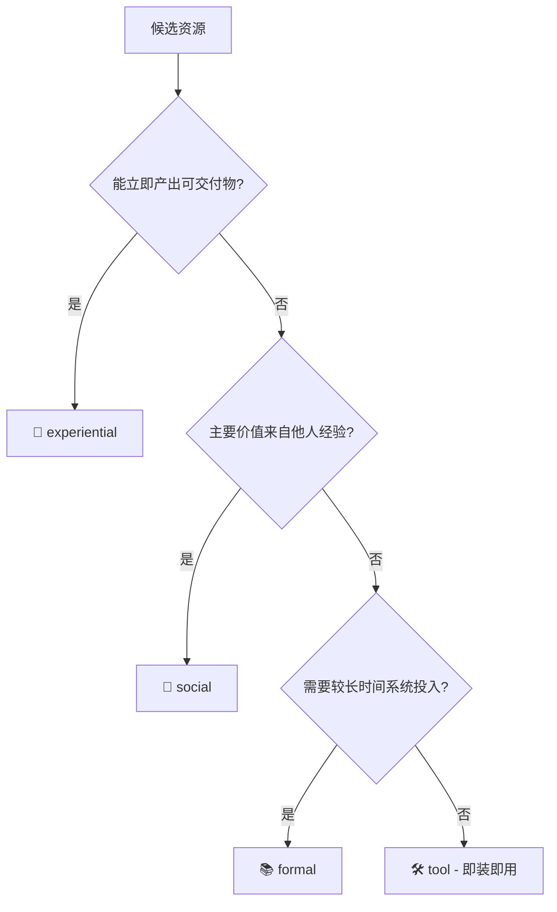

# 70-20-10 赋能形态分类法

> **70-20-10 法则**：成年人职场学习中，约 **70%** 来自在岗实践与解决真实问题，**20%** 来自与他人的互动（导师、同侪、经验分享），**10%** 来自正式的课程与阅读。本 Demo 将这一经典学习科学模型落为产品中的**七类赋能形态**，并正交引入第四维的**工具直接使用**。

## 一、四大分组 × 七类形态

| 分组 | 占比基准 | 子类形态 | learning_mode | 资源字段 |
| --- | --- | --- | --- | --- |
| 🎯 **在实践中学** | 70% | 内部项目 / Hackathon | `experiential` | `internal_projects.json` |
|  |  | 沙盒 Lab 环境 | `experiential` | `labs.json` |
| 👥 **向他人学** | 20% | 导师 1:1（静态池 + Expert Finder 动态叠加） | `social` | `mentors.json` + P2 Expert Finder |
|  |  | 过往案例库 ⭐ | `social` | `case_studies.json` |
|  |  | Tech Talk / 经验分享 / 学习社群 | `social` | `tech_talks.csv` + `communities.json` |
| 📚 **系统学习** | 10% | 课程（含微课） | `formal` | `courses.csv` |
|  |  | 技术文档 / 书籍 / 论文 | `formal` | `readings.csv` |
| 🛠️ **工具直接用** | 正交 | AI Copilot / 工具 | `tool` | `tools.csv` |
|  |  | Prompt 模板库 / 工作流 SOP | `tool` | `prompt_library.json` |

**"正交"的含义**：工具类不参与 70-20-10 的配比（因为它不承担"学习"的主要功能，而是"使能"），但在推荐时与前三组平行展示。

## 二、每类形态的决策树

推荐时如何决定资源归属哪一组？以下是 Demo 的判定逻辑：

### 典型判定例

| 资源 | 判定 | 依据 |
| --- | --- | --- |
| "AI 客服 V2 孵化项目（8 周）" | experiential | 结束后有真实产品产出 |
| "林悦（MENTOR.003）1:1 辅导" | social | 经验传递是核心价值 |
| "CASE.002 RAG 从 40% 到 82%" | social | 别人做过并复盘的案例 |
| "COURSE.009 大模型应用开发实战（10h）" | formal | 系统性投入时间学习 |
| "COURSE.002 Python 入门 10 分钟微课" | formal（但标 `is_micro`） | 微课仍属系统学习，但学习成本 ≪ 常规课程 |
| "TOOL.001 GitHub Copilot" | tool | 开箱即用，无需"学习过程" |
| "PROMPT.001 RAG 查询改写 Prompt" | tool | 直接复制到应用里即用 |

## 三、推荐阶段如何对齐 70-20-10？

### 召回阶段
- **七路推荐器并行**，每路内部按 `related_competencies` 匹配度召回 Top-20
- 每路的 `learning_mode` 标签已固定在基类定义（不随资源动态变化）

### 精排阶段
- LLM Prompt 模板 `RERANK_RESOURCE` 接收 `learning_mode_constraint` 参数
- 每个 mode 有独立约束文案（来自 `LEARNING_MODE_CONSTRAINT` 字典）：

| mode | 约束文案 |
| --- | --- |
| experiential | 优先推荐可以动手产出可见成果、能在工作流中自然承接的实践机会；避免纯理论课程。 |
| social | 优先推荐与员工当前能力鸿沟差距适中（约 1-2 级）、能提供可复用模板或 1:1 指导的资源。 |
| formal | 优先挑选路径清晰、可在 2-4 周完成的内容；偏好微课（<15min）+ 深度资料的组合。 |
| tool | 优先推荐可立即上手、ROI 高、不需要重度学习的工具或模板。 |

### 展示阶段
- Streamlit 推荐页按 4 个 Tab 展示，每个 Tab 标题含占比：
  - `🎯 在实践中学 (70%)`
  - `👥 向他人学 (20%)`
  - `📚 系统学习 (10%)`
  - `🛠️ 工具直接用 (正交)`
- 每张卡带 `learning_mode` 色带 + 来源类型徽章

### 30/60/90 天路径合成
`pathway_generator` 在兜底路径中硬编码了每阶段的 mode 组合：

| 阶段 | 主 mode 组合 | 用意 |
| --- | --- | --- |
| 30d "打基础" | formal + tool + social | 最低门槛补基础 + 上手工具 + 找个参考对象 |
| 60d "在实践中学" | experiential + social + formal | 进入真实项目，带导师与案例护航 |
| 90d "独当一面" | experiential + social + tool | 挑战产出，与社群互动，熟练使用工具 |

## 四、资源池设计要点

- **`is_micro` 字段**（课程专属）：≤15 分钟标记为微课，对应"碎片时间学习"场景；低熟练度员工优先推荐
- **`capacity_per_month`**（导师专属）：控制导师不被过度消费；推荐时做硬约束
- **案例库四段式**（`case_studies.json` ⭐）：`context / approach / pitfalls / outcome`，提供"从坑到结果"的完整经验，是 social 路最核心的资源
- **Hackathon 与 internal_project 合并**：都归 `experiential`，通过 `type` 字段区分展示

## 五、常见误判与修正

| 误判 | 正确做法 |
| --- | --- |
| 把长时段课程（40h）推给紧急任务场景 | 紧急场景限定 `is_micro=true` 微课 + Prompt 模板 |
| 把项目推给缺乏基础的新人 | 项目门槛与员工 have_level 做硬匹配，差距 ≥2 级时降级到 Lab |
| 所有员工一律推"某经典书" | 书籍不适合 gap 很高、学习投入有限的人，此类场景跳过 reading |

## 六、与 Phase 2/3 的衔接

- **Phase 2 任务内嵌学习**：把 `experiential + social + formal` 三件套（案例 + 代码片段 + 微课）打包附到任务卡片
- **Phase 2 Expert Finder**：基于 `competency_timeline` 动态识别"近期高产出者"，叠加到 `social` 路
- **Phase 3 双视图**：推送卡片栈按 learning_mode 分色带，"任务内嵌学习"卡高亮置顶
